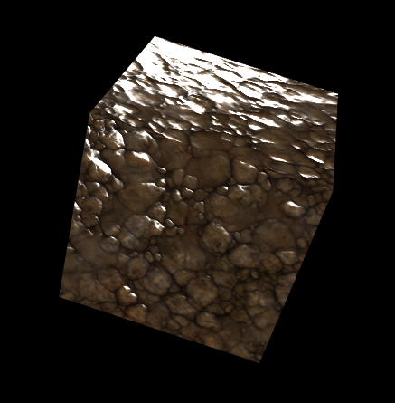
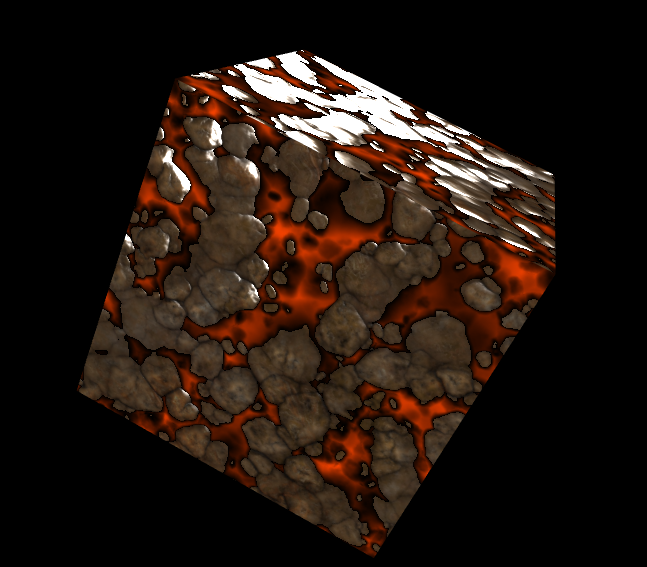

# CS174A - Final Group Project

## Team member info

Xiao Yang 305346127
Zhengyang Liu 105114114

## Background

The main inspiration of our project comes from various modern AAA titles, such as DOOM and Anthem, which employs many advanced technologies while shading the environment. Our project simulates a rough rock surface populated by hot, molten lava.

## Introduction to Design and Implementation

Unlike many of the previous final project submission, our project put a stronger emphasis on the underlying rendering technology. First, we can't have lava without the underlying rocky surface, therefore we first give a basic implementation of a textured, normal mapped phong shader for the rocks. The rock texture comes from a free source online.

Note that the specular value has been toned up to a rather unrealistic value - so that we can easily verify that the normal mapping is working as intended.

Lava, just like any liquid, behaves in such a way that it fills all the volume below a certain height. We take advantage of this liquid-specific property to implement a procedural way of spawning and rendering lava given just an extra height map. The technical detail is discussed in the Advanced Features section below.

Given the static lava rendering, additional experimental techniques are also used to animate the result. Firstly, the lava color is interpolated between bright orange and red, linearly with respect to time, giving a "burning" expression to the lava. We also experimented using flow maps to manipulate the uv coordinate per fragment, which is detailed below.

## Advanced features

### Feature 1: height-generated lava

This implementation is a simplified version implemented by the famous AAA multiplayer game Anthem, which is examined in great detail in a GDC 2019 talk.

We have 3 textures controlling different aspects of rendering. The albedo texture serves as a texture for diffuse color, normal texture stores the normal at each point, whereas the bump map stores the height of each point. Combined, the final rendered product will be a seemingly "rough" surface while the underlying primitive stays a flat plane. In our implementation, only the first channel of the height map is used - it is that "height" of a point directly above the "true position", the updated position is for calculating lighting model only.

If a fragment is found to be below a certain threshold (the "sea level" of the lava), then we immediately disregard the result from the phong lighting model. That is because we want the lava to be unlit. (Or emissive, if we have any sort of global illumination) The color of the lava is based only on the "depth" of lava at a point, the deeper the lava, the hotter the region is thus the more bright the lava appears to be. We linearly interpolate from black to a bright lava color, using the parameter which is height rescaled to [0,1].

### Experimental feature 2: flow map

The flow map serves as an experimental method to animate the lava flow. It is explained in detail in a GDC 2018 talk.

## Bonus: possible optimizations, and why we did not do that

Since we calculate height as distance directly above a fragment, only its x(or red) value is used. In the flow map, since it represents the speed vector of uv, only xy(rg) channels are used. We could potentially put height as the z(blue) channel in the flow map, thus reducing texture VRAM cost by 1/4 by reducing one texture. We did not do that because it is potentially confusing for the reader.

## References

GDC 2019, Shading the World of Anthem (https://www.youtube.com/watch?v=IjQWRjWZGn0)

GDC 2018, Applying AAA Techniques on Mobile Games: Understanding Flow Maps and Its Applications (https://www.gdcvault.com/play/1025044/Applying-AAA-Techniques-on-Mobile)

Rock texture (https://3dtextures.me/2020/07/07/stylized-rocks-001/)

## Environment setup

This project is based directly on the given architecture, no additional setup is required.